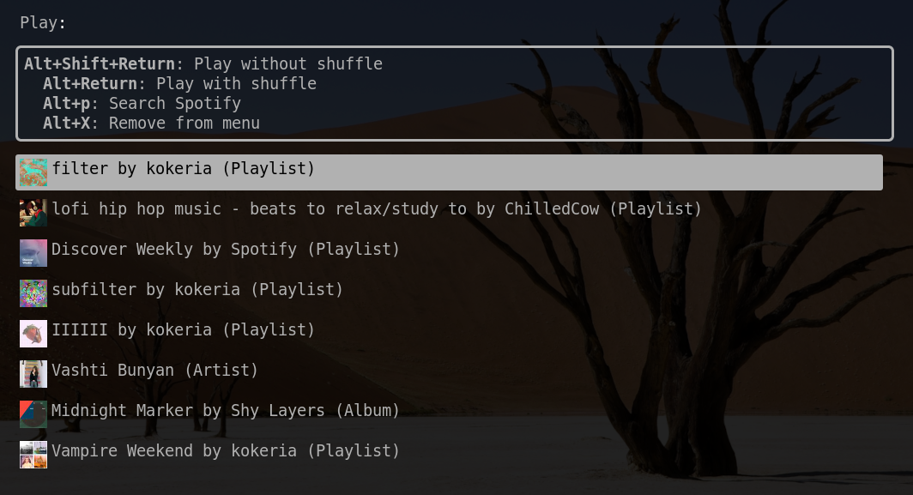
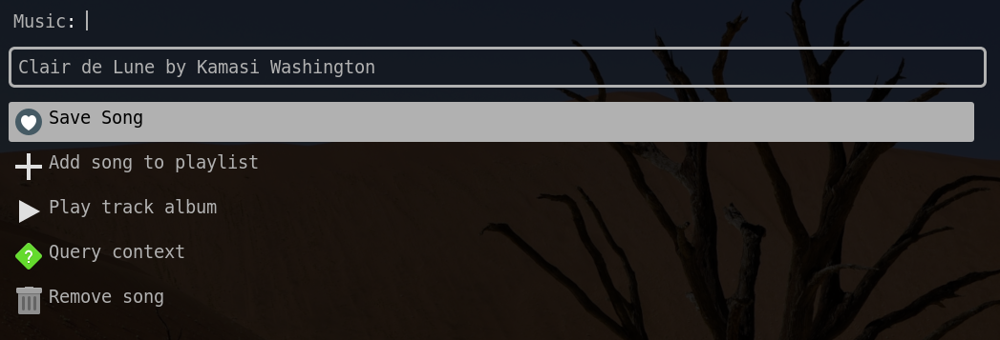
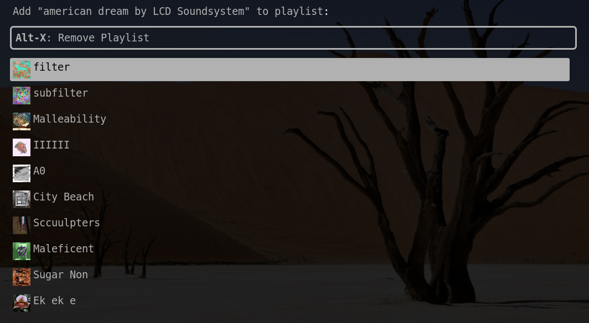

# PlayMenu
A python-based [Rofi](https://github.com/davatorium/rofi) script that allows you to quickly interact with your [Spotify](https://www.spotify.com/us/home/) music session.
All menus can be quickly opened via command and text is fuzzy searched.

I recommend keybinding the menu commands using a tool such as [sxhkd](https://www.google.com/search?q=sxhkd&oq=sxhkd&aqs=chrome..69i57j35i39j0l6.1173j0j1&sourceid=chrome&ie=UTF-8).

PlayMenu is focused on making minimal API calls in order to avoid any menu delays due to HTTP requests.

Allows quick menu access for:
- Adding the current song to a user playlist
- Saving/removing currently playing song
- Playing from a personal local list of favorite playlists/artists/albums

## Setup

**Since PlayMenu relies on Rofi menus, only operating systems supporting Rofi are supported. (GNU/Linux, FreeBSD, etc.)**

- Clone this repository and run `build.sh` to generate build/play-menu executable
- Copy build/play-menu to a folder in your PATH such as `/bin`

### Dependencies

- [Python 3](https://www.python.org/download/releases/3.0/)
- [Rofi](https://github.com/davatorium/rofi)
- [Spotipy](https://spotipy.readthedocs.io/en/2.17.1/)
- [python-rofi](https://github.com/bcbnz/python-rofi)

- (Optional) [googlesearch-python](https://pypi.org/project/googlesearch-python/)

## Usage
### "Play" menu
Running `play-menu p` will open a list of favorite artists/playlists/albums

These items are stored in `~/.config/play-menu/favorites.txt` and added with `play-menu a [uri]`

With the optional `googlesearch-python` dependency, you can also press `Alt-p` play the first result of an inputted search.

### "Save" menu
Running `play-menu s` will open a list of actions to perform on the current song/context
- Save song
- Add song to playlist
    - Opens the menu from play-menu sp
- Play track album
- Query context
  - Will send a notification after fetching the current playing context (The playlist, album, etc. that the current song is playing from)
- Remove song
  - Save and remove appear on the menu for all songs to avoid API request for save status

### Add current song to playlist
Running `play-menu sp` will open a menu of user playlists to add the current song to.

These items are stored in `~/.config/play-menu/my_playlists.txt` and added with `play-menu a -p [uri]`

### Add a playlist, artist, or album to favorites
Run `play-menu a {URI}` to add a URI to your favorites list (the list used in "Play" menu).

Run `play-menu a -p {URI}` to add a URI to your personal playlist list (the list used when adding songs to playlists).

## Theme

The Rofi theme from the screenshots is included as `PlayMenu.rasi`.
Any Rofi theme will work, but this one was made specifically to have big images for the album covers.